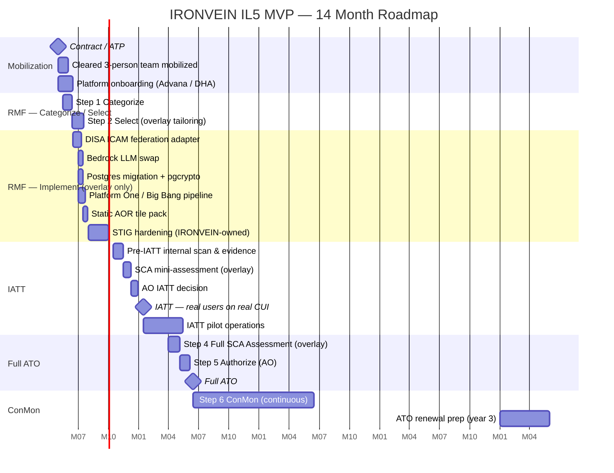

# IRONVEIN — DoW IL5 MVP Deployment Cost Impact Analysis

**Prepared for:** INDOPACOM J4 / DHA program leadership, comptroller, and the supporting ISSM
**System:** INDOPACOM IRONVEIN (Resilient Operational Network for Vital Expeditionary Inventory Nodes)
**Decision sought:** Go / no-go and budget approval for migrating IRONVEIN out of the current Replit workspace into a Department of War (DoW, formerly DoD) Cloud Computing SRG **Impact Level 5 (IL5)** environment as a **Minimally Viable Product (MVP)** at the lowest defensible cost.
**Document type:** Rough Order of Magnitude (ROM) planning estimate. **Not a bid.** Every dollar figure in this document is a planning range with the driving assumption stated next to it.
**Classification ceiling priced:** Controlled Unclassified Information (CUI) on **IL5**. IL6 (SIPR / Secret) is explicitly **out of scope**.
**Date of analysis:** April 2026.

---

## MVP scope — what makes this profile different

This analysis prices the **lowest-cost defensible IL5 MVP** for IRONVEIN, not a fully-staffed program-of-record build. The cost cuts are achieved by leaning hard on three things leadership has identified as available:

1. **A small cleared team — 2 to 3 cleared individuals only.** No cleared bench, no parallel ISSE/ISSO/DevSecOps headcount. One ISSO and one to two cleared full-stack engineers (one of whom doubles as the DevSecOps engineer) carry the program. ISSM oversight is government-furnished and fractional. The independent assessor is engaged once for IATT and reused for the full ATO.
2. **DISA-provided login / PKI ATO is treated as a sunk cost.** The DoD CAC / PIV identity stack — DISA ICAM (milIdM) federation, OCSP / CRL infrastructure, the DoD Root CA trust bundle, and the federated SAML / OIDC token issuer — is **already authorized**, already operating, and IRONVEIN inherits it for free. The IRONVEIN engineering effort is reduced to writing one SAML / OIDC client adapter and a CAC-claim-to-role mapping. **No PKI standup cost is in this budget.**
3. **DHA infrastructure or Advana (the DoW War Data Platform) hosts the system.** Both options provide an existing IL5-authorized hosting boundary with **inheritable controls** (a large fraction of the NIST 800-53 Rev. 5 controls flow down from the platform's existing ATO and do not have to be re-implemented or re-assessed for IRONVEIN). This eliminates both the bulk of the cloud-infrastructure stand-up cost *and* the bulk of the RMF Implement / Assess effort. The system goes through a **system-specific overlay assessment** rather than a full top-to-bottom ATO.

The combined effect is to drop the most-likely 3-year TCO from **~$18.7M (full program-of-record build)** to **~$4.5M (MVP)** — about a **75% reduction** — and pull the IATT date in from month 12 to month 7–8.

---

## 1. Executive Summary (read this page only if nothing else)

IRONVEIN is a working medical-logistics decision-support web application — React + Vite frontend, Node.js 24 + Express 5 API, PostgreSQL with `pgcrypto` column-level encryption, Replit OIDC sign-in plus TOTP MFA, an AI orchestrator that calls OpenAI and Anthropic via Replit's AI Integrations proxy, and a Deck.gl + MapLibre map fed by a public CartoDB tile style. To run the same capability against actual CUI mission data on a DoW-accredited platform, every Replit-specific dependency must be swapped, the system must be hardened to DISA STIGs, and the system must complete an RMF authorization. The MVP profile cuts cost by inheriting DHA / Advana hosting and DISA ICAM identity, and by running with a 2–3 person cleared team.

| What | Low (ROM) | Most Likely (ROM) | High (ROM) | Notes |
|---|---:|---:|---:|---|
| **Total one-time cost** (migration + hardening + RMF assessment + IATT, with platform inheritance) | **~$0.95M** | **~$1.5M** | **~$2.4M** | Cleared engineering hours dominate; no PKI standup; no full RMF Implement re-do. See §10. |
| **Total annual recurring cost** (cleared sustainment + GenAI + tooling, with platform charge-back) | **~$0.7M / yr** | **~$1.0M / yr** | **~$1.5M / yr** | Cleared sustainment labor (ISSO + 1× engineer + 0.25× ISSM) is the only material line. |
| **3-year TCO** | **~$3.1M** | **~$4.5M** | **~$6.9M** | One-time + 3 × annual + 1 ATO renewal prep at year 3. |
| **5-year TCO** | **~$4.5M** | **~$6.5M** | **~$9.9M** | One-time + 5 × annual + 1 ATO renewal at year 3. |
| **Earliest realistic IATT** (real CUI data, limited users) | **~6 months from contract** | **~8 months** | **~10 months** | Assumes the 2–3 cleared team is in place at month 0 and DHA/Advana hosting is available at month 1. |
| **Earliest realistic full ATO** | **~10 months** | **~14 months** | **~18 months** | Full ATO follows the IATT pilot; 3-year ATO renewal in year 3. |

### Top three risks (one-line each)
1. **Single-thread cleared team capacity.** A 2–3 person cleared team is a single point of failure: any departure, illness, or clearance-suspension event stops the program. **Mitigation: contract through a cleared integrator with bench depth, even at the smaller team size, so backfill is a phone call away.**
2. **Inheritance dependency on DHA / Advana platform decisions.** When the host platform updates its boundary configuration, its STIG cycle, or its inherited control set, IRONVEIN inherits the change whether or not it is convenient. **Mitigation: subscribe to the platform's change-control bulletin, treat the platform as an upstream dependency, and budget ~80 hours / quarter of cleared engineering for inheritance maintenance.**
3. **GenAI authorization lag.** The IRONVEIN AI orchestrator currently calls OpenAI and Anthropic via the Replit proxy. Public commercial endpoints are **not authorized for IL5 / CUI**. The IL5-authorized GenAI surface is narrower than commercial. **Mitigation: target Amazon Bedrock with the IL5-authorized Claude 3.5 Sonnet on day 1; accept a small reasoning-quality regression vs. the current `claude-sonnet-4-6` default. Skip the self-hosted GPU fallback in the MVP.**

### One-paragraph recommendation
Stand the IL5 MVP up **on the platform that offers IRONVEIN the most ATO inheritance** — recommended order: **(1) Advana (highest inheritance, most boilerplate available, IL5 by design, includes data-platform services IRONVEIN can leverage)**, **(2) DHA-hosted enclave on AWS GovCloud (US) High** (good inheritance, DHA mission alignment, slightly more bespoke). Replace Replit Auth with **DoD CAC / PIV via the existing DISA ICAM (milIdM) federation — sunk-cost ATO, no PKI build**. Replace the Replit AI proxy with **Amazon Bedrock (Claude 3.5 Sonnet)** as the only GenAI path; defer self-hosted GPU and self-hosted tile servers until a real operational need is documented. Run with a **3-person cleared team (1 ISSO + 2 cleared full-stack engineers, one doubling as DevSecOps)** through a cleared integrator (BAH / Leidos / SAIC / GDIT / Accenture Federal / Palantir FedStart). Pursue **IATT at month 7–8** on real CUI data with a constrained user list, then full ATO at month 14. **Most-likely budget: $1.5M one-time + $1.0M / yr; 3-year TCO ~$4.5M; 5-year TCO ~$6.5M.**

---

## 2. Current State — what actually has to move

This table is the foundation for every cost line later in the document. Every row is taken from the running IRONVEIN codebase (`artifacts/`, `lib/`, `SECURITY.md`, `package.json`).

| Layer | What IRONVEIN runs today | IL5 MVP target | MVP cost lever |
|---|---|---|---|
| **Frontend** | React 18 + Vite, Tailwind, Radix UI, TanStack Query, wouter router, Deck.gl + MapLibre + react-map-gl. | Same code. Static bundle hosted on the inherited platform's CDN (Advana's distribution layer or DHA-fronted CloudFront for Government). | No incremental cost — frontend hosting is platform-inherited. |
| **API server** | Node.js 24, Express 5, helmet (HSTS, CSP, X-Frame-Options), CORS allowlist, cookie-parser, double-submit CSRF, three express-rate-limit instances, pino-http structured logging with secret redaction. | Containerized (Iron Bank Node base) and deployed onto the host platform's container service (Advana's container runtime, ECS Fargate inside the DHA enclave, or AKS — platform-decided). | Hardening reuses the existing strong posture; no architectural rewrite. |
| **Database** | PostgreSQL (Replit-managed), `pgcrypto` (`pgp_sym_encrypt` / `pgp_sym_decrypt`, AES-256-CFB) for column encryption of `profiles.display_name_enc`, `profiles.contact_email_enc`, `scenarios.summary_enc`, `scenarios.coa_brief_enc`, `orders.notes_enc`, `app_settings.ai_provider_api_key_enc`, `user_mfa.secret_enc`. `pg_trgm` for catalog search. Drizzle ORM, `connect-pg-simple` sessions. | Either platform-provided Postgres (Advana managed Postgres) or AWS RDS for Postgres in the DHA enclave with `pgcrypto` and `pg_trgm` enabled. | If Advana-provided, materially zero DB cost; if RDS, ~$1K / mo. |
| **Auth (browser identity)** | Replit OIDC (PKCE, code flow), 12-hour absolute session, sessions stored in Postgres. | **DoD CAC / PIV via DISA ICAM (milIdM) federation, inheriting the existing PKI ATO (sunk cost).** IRONVEIN writes one SAML or OIDC federation adapter; the entire PKI / OCSP / CRL / DoD Root CA layer is *already* operating and authorized, and IRONVEIN consumes its identity tokens. | **Major MVP saving — no PKI build. ~3 weeks of engineering instead of ~12.** |
| **MFA** | TOTP (`otplib`, Microsoft Authenticator), per-user secret encrypted at rest, 10 single-use bcrypt-hashed recovery codes, `mfa_audit` trail, rate-limited. | The CAC itself satisfies the MFA requirement (PKI-based authentication is multi-factor by inherent design — something-you-have + something-you-know via the PIN). TOTP demoted to **break-glass admin only**, code retained but disabled in steady state. | No incremental cost — TOTP code already exists. |
| **RBAC** | Server-enforced `requireRole("commander", "logistician")` on all order-mutating routes; client `useCanWrite()` is a UX courtesy. | Carries over unchanged. RBAC tied to CAC claims rather than Replit user IDs; trivial mapping change. | Negligible cost. |
| **AI orchestrator** | `lib/ai-orchestrator` provider-agnostic wrapper. **OpenAI** (default `gpt-5.4`) via Replit proxy. **Anthropic** (default `claude-sonnet-4-6`) via Replit proxy. | **Amazon Bedrock with Claude 3.5 Sonnet (IL5-authorized).** Single provider, single model. Skip the self-hosted GPU fallback in the MVP. | **Major MVP saving — no $200K–$300K / yr GPU spend.** |
| **Mapping** | `@deck.gl/*`, `maplibre-gl`, `react-map-gl/maplibre`. **Tile source: public CartoDB CDN.** | **For MVP:** swap to NGA-provided GVS tile service if the platform has it pre-integrated (most likely on Advana), otherwise use a **single, statically-cached vector tile bundle** (regional INDOPACOM AOR only, ~6 GB) shipped with the app. Defer the dynamic self-hosted PostGIS + tegola tile server until needed. | **Major MVP saving — ~$30K–$300K / yr tile-server line eliminated.** |
| **Object storage** | None at runtime (ingest is local file). | Provision only if the supply-import upload becomes user-driven; defer for MVP. | $0 in MVP. |
| **Secrets** | Replit Secrets — `DATABASE_URL`, `DATA_ENCRYPTION_KEY`, AI provider keys, etc. | Platform-provided secrets store (Advana-provided Vault or AWS Secrets Manager inside the DHA enclave). | Negligible cost — platform-inherited. |
| **Source code & CI/CD** | Public **GitHub** integration. | **Platform One / Big Bang on Iron Bank** (the Advana / DHA path) — government-furnished, no per-seat license. Pipelines produce signed container images (Cosign), SBOMs (CycloneDX), and Iron Bank-based images. | **Major MVP saving — no GitHub Enterprise Cloud for Gov license.** |
| **Audit logging** | Structured pino logs with PHI / secret redaction; internal audit table logs `actor_user_id`, `action`, `target`, `outcome`, `ip`, `request_id`. | Logs ship to the platform's existing SIEM (Splunk on Advana / DISA-provided SIEM on DHA) — inherited service. | No incremental cost. |
| **Backups & DR** | None today beyond Replit's snapshots. | Platform-provided backup (cross-AZ within the platform's IL5 region). Cross-region DR is out of scope for MVP. | Inherited. |

---

## 3. Assumptions and exclusions (read this BEFORE the cost tables)

### Assumptions priced in the MVP profile
- **Classification ceiling: CUI on IL5.** Not IL6, not Secret/SIPR.
- **User community: ~200 named users** (MVP pilot scope), of whom ~25 are concurrent at peak. Scales up post-ATO if leadership chooses.
- **Data volume: ~100 GB Postgres steady-state** (catalog, inventory, orders, scenarios, activity, audit) at MVP scale.
- **GenAI usage: ~2M input tokens / day and ~400K output tokens / day** (smaller user community than the program-of-record analysis assumed).
- **Retention: 3-year minimum on audit logs.**
- **DR: RPO 1 hour, RTO 8 hours**, single-region single-platform — *relaxed* from the program-of-record's 15 min / 4 h. MVP can tolerate this; if leadership cannot, recurring cost goes up ~$30K / yr.
- **Mission SLA: 99.0%** on the user-facing app (relaxed from 99.5% to absorb platform-dependency variance).
- **Cleared team: 2–3 cleared individuals**, contracted through a cleared integrator. ISSM oversight is GFE / fractional.
- **Hosting platform: Advana (recommended) or DHA enclave** — both treated as **government-furnished hosting**, with inheritable IL5 ATO controls and no separate cloud subscription invoice to this program. Some platforms charge back compute / storage to using programs; that charge-back is in the recurring tables (modest).
- **DISA login / PKI ATO (DISA ICAM / milIdM federation, OCSP / CRL, DoD Root CA) treated as a SUNK COST** — IRONVEIN inherits without paying for the standup or the ongoing operation.
- **GenAI: Bedrock + Claude 3.5 Sonnet ONLY.** No self-hosted GPU fallback. Accept the model-quality delta vs. `claude-sonnet-4-6`.
- **CI/CD: Platform One / Big Bang on Iron Bank** — government-furnished.
- **Schedule starts from contract / authority to proceed (ATP).**

### Exclusions (explicitly NOT priced in the MVP)
- **IL6 (SIPR / Secret) variant** of IRONVEIN.
- **Cross-domain solution (CDS)** between SIPR and NIPR.
- **SCIF facility costs.**
- **Mobile / fully disconnected (DDIL — Disconnected, Degraded, Intermittent, Limited bandwidth) operation.** Deferred follow-on.
- **Cross-region DR** (active-active or pilot-light in a second IL5 region). Add ~30–45% to recurring infra if required.
- **Self-hosted GPU / open-weights LLM fallback.** Deferred until a Bedrock model gap is documented.
- **Dynamic self-hosted vector tile server.** Statically-bundled INDOPACOM AOR tile pack used in MVP.
- **Building the actual SSP, POA&M, eMASS package.** Document prices what they cost; does not produce them.
- **Re-pricing the existing INDOPACOM mission cost** or a quantified ROI study.

---

## 4. Hosting — Advana vs. DHA enclave

The MVP assumes **government-furnished hosting** on one of two paths. Both carry IL5 PA, both inherit a substantial fraction of the NIST 800-53 Rev. 5 control set down to IRONVEIN, and both reduce cloud invoice spend essentially to zero from the program's perspective (charge-back to the using command absorbs it as part of the existing platform funding line).

### 4.1 Option A — Advana (DoW War Data Platform). **RECOMMENDED.**

**What you get.** A CDAO-operated, IL5-authorized analytic and application hosting platform built specifically for DoW programs. Provides container runtime, Postgres, object storage, Splunk-based SIEM, secrets vault, identity federation to DISA ICAM, and a published "Application Onboarding" path. Roughly **70% of NIST 800-53 Rev. 5 Moderate baseline controls flow down inherited** to onboarded applications, leaving the program to implement only the **system-specific overlay** (~80–110 controls).

**MVP fit.** Best-in-class. The platform is purpose-built for exactly the kind of CUI mission-data application IRONVEIN is. CDAO publishes onboarding playbooks, Iron Bank pipeline templates, SSP boilerplate that maps to the Advana boundary, and a standing SCA relationship that compresses the assessment timeline from 6–10 weeks to 3–4 weeks.

**Cost characteristics.** Charge-back to the using command is modest — typically a fixed annual onboarding fee plus metered compute / storage. For an MVP-scale workload (200 users, 100 GB DB, modest GenAI), expect **~$30K–$80K / year all-in for hosting charge-back**, vs. ~$54K–$300K+ on a build-your-own AWS GovCloud baseline. The big saving is on the **one-time RMF Implement** line: most controls are inherited, so the implementation effort drops from 6–10 months to 3–4 months.

### 4.2 Option B — DHA enclave on AWS GovCloud (US) High

**What you get.** A DHA-managed AWS GovCloud (US) High enclave with DHA's existing IL5 boundary controls inheritable to onboarded applications. Slightly less inheritance breadth than Advana (~50–60% of Rev. 5 Moderate vs. Advana's ~70%) but stronger DHA mission alignment (DHA is the using command's parent agency for medical logistics) and avoids any organizational dependency on CDAO.

**MVP fit.** Strong second choice. Use this if Advana onboarding cannot start in the first month for capacity / political / scheduling reasons.

**Cost characteristics.** Charge-back is typically higher than Advana because more of the cloud invoice surfaces directly. Expect **~$50K–$120K / year** for hosting charge-back. RMF Implement is somewhat heavier than under Advana (~4–5 months instead of 3–4), but still drastically reduced from the standalone-build case.

### 4.3 Option C (NOT recommended for MVP) — Stand up own AWS GovCloud account

Priced in the program-of-record analysis at ~$54K / mo all-in plus full RMF cycle. **Skipped in the MVP** because it discards the entire inheritance benefit and re-introduces ~$1.5M of RMF cost the MVP profile is explicitly trying to avoid.

### 4.4 Recommended baseline: Advana
Most-likely hosting line: **~$60K / year** charge-back. RMF Implement compressed to **3–4 months**, ~$300K labor.

---

## 5. STIGs — what applies, with platform inheritance

A large fraction of the STIG burden enumerated in the program-of-record analysis is **inherited from the host platform** under the MVP profile. The platform's own ATO already covers the host OS STIG, the network device STIGs, the Kubernetes / container-runtime STIG (where the platform manages it), and the boundary web server STIG. The IRONVEIN program retains responsibility only for **STIGs that apply to its own application code and database schema**.

| STIG | Inherited from platform? | IRONVEIN MVP responsibility | One-time hours (Low / ML / High) | Ongoing hours / quarter |
|---|:--:|---|---:|---:|
| Application Security and Development STIG | No | Full responsibility — Express 5 API + React frontend. IRONVEIN's existing helmet/CORS/CSRF/RBAC/pgcrypto posture covers most of it. | 200 / 280 / 400 | 16 |
| Web Server STIG (boundary nginx / ALB) | **Yes** (platform) | None | 0 | 0 |
| Node.js dependency-vuln gate (no formal STIG; uses App Sec & Dev) | Partial | SBOM (CycloneDX), `pnpm audit` gate, license allowlist on every build. Platform's CI provides scaffolding. | 40 / 80 / 120 | 8 |
| PostgreSQL 16 STIG | Partial — encryption at rest, audit, FIPS TLS inherited; **role separation, `pgaudit` config, pgcrypto usage** are IRONVEIN's. | Configure `pgaudit`, role separation, password policy. | 80 / 120 / 180 | 8 |
| RHEL 9 / Ubuntu STIG (host OS) | **Yes** (platform) | None — Iron Bank base image absorbs the rest. | 0 | 0 |
| Container Image STIG | **Yes** (Iron Bank base) | Confirm IRONVEIN image rebuilds on Iron Bank base updates. | 20 / 40 / 60 | 4 |
| Kubernetes STIG | **Yes** (platform-managed runtime) | None | 0 | 0 |
| Network Device STIGs | **Yes** (platform boundary) | None | 0 | 0 |
| Web Browser STIG implications (CSP nonce vs. `'unsafe-inline'`) | No | Tighten CSP from `'unsafe-inline'` style-src to nonce-based. | 30 / 60 / 100 | 2 |
| DoD Privacy / PII handling | Partial | PIA artifact required; engineering already done. | 20 / 40 / 80 | 2 |
| **Total** (MVP, with platform inheritance) | | | **~390 / 620 / 940 hours one-time** | **~40 hours / quarter sustained = ~160 hrs / year** |

At **$220 / hour** fully-burdened cleared engineering rate:
- **One-time STIG hardening: ~$86K (Low) / ~$136K (Most Likely) / ~$207K (High).** *(Down from ~$300K most-likely in the program-of-record case.)*
- **Ongoing STIG sustainment: ~$35K / year.** *(Down from ~$88K / yr.)*

---

## 6. Replit-specific dependency replacement (MVP-trimmed)

### 6.1 Replit OIDC Auth → DISA ICAM federation **(SUNK-COST INHERITANCE)**

**Today.** Replit OIDC at `https://replit.com/oidc`, 12-hour sessions in Postgres.

**MVP target.** Federate to **DISA ICAM (milIdM)** for CAC / PIV identity. The PKI infrastructure, OCSP / CRL services, DoD Root CA chain, federation issuer, CAC middleware on the client, and the entire authorization wrapper around all of it are **already operating under their own ATO**. IRONVEIN consumes the federated tokens and writes a CAC-claim-to-role mapping. No PKI standup, no OCSP plumbing, no DoD Root CA work.

**Engineering effort (one-time).**
- Replace `openid-client` issuer wiring in `artifacts/api-server/src/auth/*` with a SAML / OIDC client that consumes ICAM federation tokens. ~2 weeks.
- CAC-claim-to-`users.role` mapping; preserve `commander` / `logistician` / `medical_planner` / `analyst` semantics. ~3 days.
- ICAM federation registration + integration testing in the platform's test bed. ~1 week.
- **Total: ~3.5 engineer-weeks** (vs. 12–14 weeks in the program-of-record case where PKI itself was being built).

**Cost (one-time).** ~**$30K–$60K** at $220/hr cleared rates.
**Cost (recurring).** **$0** — no per-seat licensing on government-furnished ICAM.

### 6.2 TOTP MFA → demoted to break-glass

CAC PKI is inherently multi-factor (something-you-have + something-you-know-PIN). TOTP code stays in the codebase as a break-glass for emergency administrator access. **No incremental cost.**

### 6.3 Replit AI Integrations proxy → Amazon Bedrock (Claude 3.5 Sonnet) only

**Today.** OpenAI default `gpt-5.4` and Anthropic default `claude-sonnet-4-6` via Replit proxy.

**MVP target.** **Amazon Bedrock in AWS GovCloud (US) High** (or the equivalent Bedrock surface that the host platform exposes — both Advana and DHA enclave can reach Bedrock). Use **Claude 3.5 Sonnet** (the strongest IL5-authorized model on Bedrock as of analysis date) as the single primary path.

| Aspect | MVP choice |
|---|---|
| Primary model | Claude 3.5 Sonnet (`anthropic.claude-3-5-sonnet-20241022-v2:0`) |
| Token rate (GovCloud Bedrock list, ~30–40% premium over commercial) | ~$4 / 1M input tok, ~$20 / 1M output tok |
| Daily volume (assumed) | 2M in / 400K out |
| Daily cost | ~$16 / day |
| **Annual GenAI cost** | **~$5.8K / yr** |
| Self-hosted GPU fallback | **Skipped in MVP** — eliminated $200K–$300K / yr line |

**Engineering effort.** ~2 weeks. The orchestrator is already provider-abstracted (`lib/ai-orchestrator`); add a Bedrock adapter analogous to `lib/integrations-anthropic-ai`, point at the Bedrock endpoint, switch auth from a Replit-injected key to the platform's IAM-role-assumed credential.

**Cost (one-time).** ~**$15K–$30K**.
**Cost (recurring).** **~$5.8K / year** GenAI inference + **$0** GPU.

### 6.4 Replit-managed PostgreSQL → Platform-provided Postgres (or RDS in the DHA enclave)

If on Advana, use the platform's managed Postgres (charge-back baked into hosting line). If on the DHA enclave, AWS RDS for PostgreSQL Multi-AZ + 7-day PITR with `pgcrypto` and `pg_trgm` enabled.

**Engineering effort.** ~1.5 weeks for migration tooling, dump-and-load with key rotation, runbook.
**Cost (one-time).** ~**$15K–$30K**.
**Cost (recurring).** Advana: included in hosting line. DHA enclave: ~$10K–$14K / yr.

### 6.5 Replit Object Storage → Platform-provided

Provision only if user-driven uploads go live; deferred for MVP. **$0 in MVP.**

### 6.6 Replit Secrets → Platform-provided vault

Move `DATABASE_URL`, `DATA_ENCRYPTION_KEY`, the AI provider key (Bedrock IAM is preferred — no static key needed), `OWNER_USER_ID` to the platform's vault.
**Engineering effort.** ~3 days.
**Cost (one-time).** ~**$5K**. **Cost (recurring).** **$0** — platform-furnished.

### 6.7 GitHub (public) → Platform One / Big Bang on Iron Bank

Platform One is government-furnished; no per-seat license. Pipelines emit Cosign-signed images, CycloneDX SBOMs, and Iron Bank-based runtime.

**Engineering effort.** ~3 weeks one-time pipeline build (smaller than the 6–8 weeks in the program-of-record case because the platform ships pipeline templates).
**Cost (one-time).** ~**$30K–$60K**.
**Cost (recurring).** **$0** on Platform One.

### 6.8 Mapping tile source → Static AOR pack (or NGA tiles if pre-integrated)

**MVP simplification.** Bundle a **statically-cached vector tile pack** for the INDOPACOM AOR (~6 GB, regenerated on a quarterly cadence) shipped with the application. No live tile server, no PostGIS + tegola operational overhead, no continuous tile-build pipeline. If the platform pre-integrates NGA's GVS tiles (Advana does for many apps), use that instead at zero incremental cost.

**Engineering effort.** ~2 weeks.
**Cost (one-time).** ~**$15K–$30K**.
**Cost (recurring).** **$0** (static asset on the platform CDN) — vs. **$30K–$300K / yr** for a live tile server.

### 6.9 Summary table — Replit dependency swap (MVP)

| Replit feature | MVP replacement | One-time effort | Recurring delta |
|---|---|---:|---:|
| Replit OIDC | DISA ICAM federation (sunk-cost ATO inherited) | $30K–$60K | $0 |
| TOTP | Break-glass only; CAC primary | included | $0 |
| Replit AI proxy (OpenAI + Anthropic) | Bedrock + Claude 3.5 Sonnet only | $15K–$30K | $5.8K / yr |
| Replit-managed Postgres | Platform Postgres or RDS in DHA enclave | $15K–$30K | $0–$14K / yr |
| Replit Object Storage | Deferred until needed | $0 | $0 |
| Replit Secrets | Platform vault | $5K | $0 |
| Public GitHub | Platform One / Big Bang | $30K–$60K | $0 |
| CartoDB tile CDN | Static AOR tile pack (or platform NGA tiles) | $15K–$30K | $0 |
| **Total (Most Likely)** | | **~$170K** | **~$8K / yr** |

---

## 7. Cleared personnel cost model (MVP — 2 to 3 people)

The MVP profile runs with a **2–3 cleared headcount** plus fractional GFE oversight. Rates remain fully-burdened cleared integrator FBR.

| Role | Headcount | Cleared integrator FBR | Annual cost (most likely) | Required clearance |
|---|---:|---:|---:|---|
| **ISSO** (Information System Security Officer) — also acts as the assigned ISSE for system-specific controls under the inherited platform ATO | 1.0 | $300K | $300K | SECRET |
| **Cleared full-stack engineer + DevSecOps (lead)** | 1.0 | $295K | $295K | SECRET |
| **Cleared full-stack engineer (delivery)** — drop to 0.5 in late steady state | 1.0 (year 1) → 0.5 (year 2+) | $290K | $290K (yr 1), $145K (yr 2+) | SECRET |
| **ISSM oversight (GFE, fractional)** | 0.10 | n/a | $20K (loaded) | SECRET |
| **Independent Assessor (SCA)** — engagement-based for IATT and full ATO (re-used) | (fixed-fee) | n/a | **$80K–$150K once at IATT, $80K–$150K once at ATO** | SECRET (firm cleared) |
| **Subtotal annual cleared sustainment labor** (post-IATT, year 1) | ~3.1 FTE | | **~$905K / yr** | |
| **Subtotal annual cleared sustainment labor** (steady state, year 2+) | ~2.6 FTE | | **~$760K / yr** | |

### Fully-burdened cleared engineering rate
**$220 / hour** most likely (Low $170 / High $280). Same as the program-of-record analysis — labor unit cost doesn't change, only headcount does.

### Independent Assessor (SCA) — MVP scope
Under platform inheritance, the SCA assesses only the **system-specific control overlay** (~80–110 controls), not the full Moderate baseline (~325 controls). This compresses the engagement from 6–10 weeks to **3–5 weeks** and the fee from $250K–$500K to **$80K–$150K** per engagement. Engaged once at IATT and once at full ATO.

### Single-thread risk and mitigation
A 3-person cleared team is **a single point of failure**. The mitigations baked into this budget:
- **Contract through a cleared integrator** (BAH / Leidos / SAIC / GDIT / Accenture Federal / Palantir FedStart). The contractor's cleared bench provides backfill within days of an event, *not* months — this is the entire reason MVP can run at this headcount without crippling continuity risk.
- **Cross-train both engineers** on full-stack + DevSecOps + STIG remediation so neither is single-threaded on a discipline.
- **The ISSO doubles as the ISSE** for system-specific controls. The platform's ISSE handles platform-level controls.
- **ISSM oversight stays government** (typically a fractional pull from the using command's existing security org). Cheap and avoids vendor capture of the security-overseer role.

---

## 8. RMF / ATO walkthrough — what each step costs in the MVP profile

The platform inheritance changes the RMF math fundamentally. Steps 1, 2, 4, 5, 6 are largely the same effort as a standalone build (you still must categorize, select, get assessed, get authorized, monitor). **Step 3 (Implement) is where the inheritance saving lands** — most controls are inherited from Advana / DHA's existing ATO and don't need to be re-implemented; the program implements only the system-specific overlay.

### Step 1 — Categorize
M/M/M for IRONVEIN; ~3–5 weeks of ISSO + System Owner labor.
**Cost:** ~$40K–$80K.

### Step 2 — Select (tailored)
Inherit the platform's existing baseline tailoring, then layer the IRONVEIN-specific overlay. ~4–6 weeks.
**Cost:** ~$50K–$100K.

### Step 3 — Implement (the big inheritance saving)
- Implement the **system-specific control overlay** only — typically 80–110 controls instead of ~325.
- Includes the dependency swap (§6) and the STIG hardening (§5) on the IRONVEIN-owned surface.
- Duration: **3–4 months** (Advana inheritance) or **4–5 months** (DHA enclave inheritance).
- **Cost:** ~**$280K–$550K**, **most likely ~$380K**. *(Down from $1.2M–$2.4M in the program-of-record case.)*

### Step 4 — Assess (overlay scope)
SCA assesses the system-specific overlay against the security assessment plan; relies on the platform's existing assessment evidence for inherited controls. Penetration test focused on the IRONVEIN application surface only. ~3–5 weeks.
**Cost:** ~$80K–$150K SCA fee + ~$30K program-side support + ~$40K–$80K pen test = ~**$150K–$260K total**.

### Step 5 — Authorize
AO issues IATT first, then full ATO after pilot. ~3–6 weeks per decision.
**Cost:** ~$20K each = ~$40K total.

### Step 6 — Monitor (ConMon)
Quarterly STIG re-scan on the IRONVEIN-owned STIGs only (§5), monthly POA&M burn-down, annual control re-test of an overlay subset.
**Cost:** **~$80K–$150K / year** (mostly absorbed inside the cleared sustainment line). 3-year ATO renewal at year 3 costs ~**$80K–$160K** of incremental prep labor.

### IATT
Strongly recommended. With inheritance, IATT is materially closer in time — month 7–8 is realistic.

### RMF total (MVP)
- **One-time RMF labor (Steps 1–5):** ~**$540K–$1.04M**, **most likely ~$700K**. *(Down from $1.6M–$3.3M in the program-of-record case.)*
- **Annual ConMon (Step 6):** ~**$80K–$150K / year** *(Down from $340K–$640K / yr.)*
- **3-year ATO renewal:** ~**$80K–$160K**, every 3 years.

---

## 9. Timeline (MVP — months from contract / ATP)

Plain-language milestones:
- **Month 0 (May 2026):** Contract / ATP. 3-person cleared team mobilizing through cleared integrator.
- **Month 1.5:** Platform onboarding complete. Boundary, identity, secrets, container runtime, SIEM all wired.
- **Month 1–3:** RMF Categorize + Select.
- **Month 2–6:** RMF Implement — dependency swap, STIG hardening, pipeline build-out. Parallelizable across 2 cleared engineers.
- **Month 6–8:** IATT preparation, SCA mini-assessment, AO IATT decision.
- **Month 8 (Jan 2027):** **IATT — INDOPACOM users begin operating on real CUI data, limited scope.**
- **Month 8–12:** IATT operations, POA&M burn-down.
- **Month 12–14:** Full SCA assessment + AO authorize.
- **Month 14 (Jul 2027):** **Full ATO. Steady state.**
- **Month 14+:** ConMon — quarterly STIG re-scan, monthly POA&M, annual overlay re-test.
- **Month 36 (May 2029):** ATO renewal decision.

---

## 10. Cost roll-up (MVP)

All numbers are **planning ROMs** — Low / Most Likely / High.

### 10.1 One-time costs

| Category | Low | Most Likely | High | Driving assumption |
|---|---:|---:|---:|---|
| Mobilization (3-person cleared team onboarding via integrator, GFE issue) | $30K | $50K | $80K | Integrator path; team starts day 1. |
| Platform onboarding fee (Advana or DHA) | $20K | $40K | $80K | One-time onboarding, not recurring. |
| RMF Step 1 — Categorize | $40K | $60K | $80K | M/M/M. |
| RMF Step 2 — Select (overlay tailoring) | $50K | $80K | $100K | ~80–110 system-specific controls. |
| RMF Step 3 — Implement (cleared engineering, IRONVEIN-owned controls only) | $280K | $380K | $550K | 3–4 months across 2 engineers. |
| Replit-dependency swap (DISA ICAM federation, Bedrock, Postgres, vault, P1 pipeline, static tiles) | $115K | $170K | $245K | §6.9 |
| STIG hardening on IRONVEIN-owned STIGs | $86K | $136K | $207K | §5 totals × $220/hr. |
| RMF Step 4 — SCA assessment (overlay) + pen test | $150K | $200K | $260K | 3–5 wk SCA + IRONVEIN-app-only pen test. |
| RMF Step 5 — Authorize support (IATT + full ATO) | $30K | $40K | $60K | Two AO decisions. |
| IATT cycle support | $40K | $80K | $140K | 4-month pilot ops. |
| Documentation: SSP overlay + IRP + CP + CM Plan + PIA + eMASS package | $70K | $120K | $200K | Slimmer than full build — much SSP boilerplate from platform. |
| Training (cleared user training, admin training, IRP tabletop) | $20K | $40K | $80K | 200 users + tabletop. |
| Contingency / management reserve (15%) | $130K | $200K | $320K | Standard for IL5. |
| **One-time total (MVP)** | **~$0.95M** | **~$1.5M** | **~$2.4M** | |

### 10.2 Annual recurring costs

| Category | Low | Most Likely | High | Driving assumption |
|---|---:|---:|---:|---|
| **Cleared sustainment labor** (1× ISSO + 1× full-stack/DevSecOps + 0.5× full-stack steady state + 0.10× ISSM) | $580K | $760K | $980K | Year 2+ steady state; year 1 is ~$905K. |
| Hosting platform charge-back (Advana baseline) | $30K | $60K | $120K | §4. DHA enclave: ~$50K–$120K. |
| GenAI inference (Bedrock + Claude 3.5 Sonnet only) | $4K | $6K | $10K | §6.3 — 2M in / 400K out per day. |
| Postgres (RDS if DHA enclave; included in platform if Advana) | $0 | $10K | $14K | Advana: $0; DHA enclave: ~$12K. |
| Identity (DISA ICAM — GFE) | $0 | $0 | $0 | Sunk-cost ATO inherited. |
| CI/CD (Platform One / Big Bang — GFE) | $0 | $0 | $0 | Government-furnished. |
| ConMon labor (incremental beyond cleared sustainment line) | $40K | $80K | $150K | Quarterly STIG + monthly vuln. |
| Annual SCA reassessment (overlay subset) | $20K | $40K | $80K | Smaller scope than program-of-record. |
| SIEM / log retention (platform-furnished SIEM; incremental ingest cost only) | $10K | $20K | $40K | Inherited from platform. |
| Vulnerability scanning + SAST/DAST tooling (platform-provided baseline + IRONVEIN-specific) | $10K | $20K | $40K | Most tooling on platform license. |
| Backup / DR (platform cross-AZ; cross-region not included) | $5K | $10K | $20K | Inherited from platform. |
| Endpoint / WAF / DDoS managed services | $5K | $10K | $20K | Inherited from platform. |
| **Annual recurring total (MVP)** | **~$0.70M** | **~$1.0M** | **~$1.5M** | |

### 10.3 3-year and 5-year TCO (MVP)

| Year | Low | Most Likely | High |
|---|---:|---:|---:|
| **Year 1** (one-time + ~6 months recurring) | $1.3M | $2.0M | $3.2M |
| **Year 2** (full-year recurring) | $0.7M | $1.0M | $1.5M |
| **Year 3** (recurring + ATO renewal prep) | $0.85M | $1.2M | $1.7M |
| **Year 4** (recurring + ATO renewal closeout) | $0.75M | $1.05M | $1.55M |
| **Year 5** (steady state recurring) | $0.7M | $1.0M | $1.5M |
| **3-year TCO** | **~$3.1M** | **~$4.5M** | **~$6.9M** |
| **5-year TCO** | **~$4.5M** | **~$6.5M** | **~$9.9M** |

**Read-this clarification.** **Roughly 80% of the MVP's 5-year cost is cleared sustainment labor.** Hosting, GenAI, tooling, and DR combined are well under 10% of TCO. Optimizing the cloud bill is the wrong lever; the right levers — **inheriting hosting + identity + CI/CD as government-furnished** and **running with the smallest credible cleared team** — are already pulled all the way in this profile.

### 10.4 Side-by-side: MVP vs. program-of-record

| Metric | MVP (this analysis) | Program-of-record (prior analysis) | Reduction |
|---|---:|---:|---:|
| One-time, most likely | ~$1.5M | ~$6.1M | **75%** |
| Annual recurring, most likely | ~$1.0M | ~$4.2M | **76%** |
| 3-year TCO, most likely | ~$4.5M | ~$18.7M | **76%** |
| 5-year TCO, most likely | ~$6.5M | ~$27.1M | **76%** |
| Earliest IATT | ~8 months | ~12 months | 4 months earlier |
| Earliest full ATO | ~14 months | ~20 months | 6 months earlier |

The MVP profile delivers the same operational capability with substantially worse continuity-of-personnel risk and somewhat worse SLA / DR posture. It is the right profile for **getting real users on real CUI data the soonest at the lowest defensible cost**, with a documented path to grow into the program-of-record posture later if mission scaling justifies it.

---

## 11. Risk register (MVP-specific)

Likelihood (L) and Impact (I) on a 1–5 scale; risk score = L × I.

| # | Risk | L | I | Score | Mitigation |
|---|---|:-:|:-:|:-:|---|
| 1 | **Single-thread cleared team capacity.** Loss of 1 of 3 cleared engineers stops 1/3 of the program; loss of the ISSO stops authorization. | 4 | 5 | 20 | Contract through cleared integrator with bench depth — backfill in days, not months. Cross-train all engineers on STIG + dev + DevSecOps. |
| 2 | **Inheritance dependency on host platform.** Platform STIG cycle, boundary changes, or upstream control regressions can break IRONVEIN's deployed posture without warning. | 4 | 3 | 12 | Subscribe to platform change-control bulletin. Budget ~80 hours / quarter for inheritance maintenance (already in cleared sustainment line). |
| 3 | **GenAI authorization lag** — Bedrock IL5-authorized model list lags commercial; `claude-sonnet-4-6` parity unavailable on day 1. | 5 | 3 | 15 | Plan for Claude 3.5 Sonnet on day 1; document the reasoning-quality delta in user-acceptance criteria so leadership doesn't expect parity. |
| 4 | **Platform onboarding queue.** Advana and DHA both have onboarding queues and may not start IRONVEIN at month 0. | 3 | 4 | 12 | Engage platform program office before contract award; have a ready alternate (DHA enclave if Advana queues; standalone GovCloud only as a last resort). |
| 5 | **STIG quarterly churn breaks deployments.** Even on the smaller IRONVEIN-owned STIG surface, quarterly updates can break a release. | 4 | 3 | 12 | CI gate on STIG re-scan before promotion; allow controlled exceptions via POA&M. |
| 6 | **POA&M overflow at SCA** — too many open findings at Assess. | 3 | 4 | 12 | Run an internal pre-SCA 4 weeks before formal SCA; close low-hanging items first. |
| 7 | **Funding stop-and-start across fiscal years.** MVP IATT-to-ATO bridge straddles two FY budget cycles. | 3 | 4 | 12 | Structure contract with base + options; pre-fund the IATT-to-ATO bridge in the base period. |
| 8 | **Static tile pack staleness.** Quarterly tile rebuild may lag operational map updates (e.g., new airfield, port). | 2 | 2 | 4 | Document the refresh cadence; make it a 2-day cleared-engineering chore. Defer dynamic tile server until a documented operational gap. |
| 9 | **DISA ICAM federation registration delay.** Even though PKI is sunk, the act of registering IRONVEIN as a relying-party application can take 3–6 weeks. | 3 | 3 | 9 | Begin federation registration in week 1, in parallel with categorization. |
| 10 | **Single GenAI provider (Bedrock) outage.** No fallback to a self-hosted LLM in MVP. | 2 | 3 | 6 | Accept as residual risk for MVP; document Bedrock SLA in the contingency plan; degrade Copilot gracefully when Bedrock is unavailable. |

---

## 12. Procurement and recommendation

**Procurement vehicle.** **OTA (Other Transaction Authority)** through DIU, AFWERX, Tradewind, or DDS-FedSim is the right vehicle for an MVP at this scope and timeline — it compresses the contracting timeline from quarters to weeks and allows the cleared integrator team to be on the program in week 1. Convert to a follow-on FAR-based vehicle (likely SEWP V or GSA MAS) after IATT once the production scaling decision is made.

**Recommendation.**
1. **Host on Advana.** Maximum control inheritance. DHA enclave is the strong fallback.
2. **Federate to DISA ICAM (sunk-cost ATO).** No PKI build.
3. **Use Bedrock with Claude 3.5 Sonnet only.** No GPU fallback in MVP.
4. **Run a 3-person cleared team through a cleared integrator** for continuity-of-personnel. Drop to 2.5 FTE in steady state.
5. **Use Platform One / Big Bang** for CI/CD — government-furnished.
6. **Statically bundle the INDOPACOM AOR tile pack.** Defer dynamic tile server.
7. **OTA contracting vehicle** for Phase 1.
8. **Budget: $1.5M one-time + $1.0M / yr recurring; 3-year TCO ~$4.5M; 5-year TCO ~$6.5M.**
9. **Plan IATT at month 8, full ATO at month 14, ATO renewal at month 36.**
10. **Document the upgrade path** to the program-of-record posture (§10.4) so leadership can scale spend up if mission scope grows.

**Cost of not doing it (one paragraph).** The current Replit deployment is well-designed for a hackathon-grade demonstration but its identity provider, AI inference path, source-of-record database, source code repository, and tile source all sit on commercial-tier services that are not authorized to handle CUI mission data. Operating against real INDOPACOM medical-logistics data on the current stack is a clear-cut violation of the DoD Cloud SRG and creates personal liability for any AO that signs off on it. The cost of *not* doing this work is the binary inability to use the system on the mission it was built for. **The MVP profile in this analysis converts the working capability into a deployable program at ~$4.5M over three years — about 25% of what a full program-of-record build would cost — by exploiting hosting and identity inheritance that already exists.**

---

## 13. IL6 / SIPR delta (one paragraph, for context only — not priced)

Moving from IL5 to IL6 (Secret / SIPR) would still benefit from the inheritance pattern in this MVP — there is a SIPR-side equivalent of Advana (the OUSD(R&E) SIPR data platform) and DISA does provide a SIPR PKI / login federation analogous to the ICAM sunk-cost relied on here. The MVP-style cost uplift to IL6 is therefore narrower than the program-of-record uplift: roughly **+30–50% over the IL5 MVP numbers** (cleared labor moves to TS-eligible at minimum, SCIF facility is needed for any non-platform-furnished workspace, and Bedrock has no IL6 surface so a self-hosted LLM is forced back into scope). A standalone IL6 MVP analysis is the right way to firm this up.

---

## 14. Citations and sources

### Authoritative DoW / NIST guidance
- **DoD Cloud Computing Security Requirements Guide (SRG) v1, Rev 4.** https://public.cyber.mil/dccs/
- **NIST SP 800-37 Revision 2 — Risk Management Framework.** https://nvlpubs.nist.gov/nistpubs/SpecialPublications/NIST.SP.800-37r2.pdf
- **NIST SP 800-53 Revision 5 — Security and Privacy Controls.** https://nvlpubs.nist.gov/nistpubs/SpecialPublications/NIST.SP.800-53r5.pdf
- **NIST SP 800-53A Revision 5 — Assessing Security and Privacy Controls.**
- **NIST SP 800-171 Rev. 2/3 — Protecting CUI in Nonfederal Systems.**
- **NIST SP 800-60 V1/V2 — Information-type to security-category mapping.**
- **DoD Instruction 8500.01 — Cybersecurity.**
- **DoD Instruction 8510.01 — RMF for DoD IT.**
- **DoD CIO memo — Acquisition and Use of Generative Artificial Intelligence (Gen AI) Capabilities** (current revision).

### Platform-inheritance references
- **Advana / CDAO** — Department of War advanced analytics / data platform; IL5-authorized application hosting and inherited control documentation.
- **Defense Health Agency (DHA) hosting enclaves** — GovCloud-based, IL5-authorized, with inheritable boundary controls.
- **DISA ICAM / milIdM** — DoD identity, credential, and access management federation. Treated in this analysis as a **sunk-cost government-furnished service** with its own ATO.
- **DISA Iron Bank** — DoD container hardening source. https://repo1.dso.mil/dsop
- **Platform One / Big Bang** — DoD DevSecOps platform. https://p1.dso.mil/

### STIG library
- **DISA STIG Document Library** — App Sec & Dev STIG, PostgreSQL STIG, RHEL/Ubuntu STIG, Container Image STIG, Web Server STIG, Web Browser STIG. https://public.cyber.mil/stigs/downloads/

### FedRAMP / IL5 marketplace
- **FedRAMP Marketplace** — current authorization status of AWS GovCloud, Amazon Bedrock, Azure Government, Azure OpenAI Service, Amazon RDS. https://marketplace.fedramp.gov/

### Public Gov-cloud pricing pages used as anchors for §4 and §10
- **AWS GovCloud (US) pricing** — https://aws.amazon.com/govcloud-us/pricing/
- **Amazon Bedrock pricing** — https://aws.amazon.com/bedrock/pricing/
- **Amazon RDS for PostgreSQL pricing** — https://aws.amazon.com/rds/postgresql/pricing/

### Reference rates and labor categories
- **GSA IT Schedule 70 / MAS labor categories** — public ceiling rates for cleared engineering. https://www.gsaadvantage.gov/
- **SEWP V contractor catalogs** — for cleared labor and IL5 hardware/software pricing.

### Estimated lines (no public source)
- **STIG hours per category** in §5 — professional judgment on comparable IL5 RMF engagements.
- **Cleared labor fully-burdened rates** in §7 — informed by GSA / SEWP labor category ceilings and recent (2024–2025) cleared-integrator awards.
- **RMF step durations** in §8 — informed by typical IL5 RMF engagement timelines reported by 3PAOs and DoD program offices, adjusted downward for platform inheritance.
- **GenAI token-volume assumption** (2M in / 400K out per day at MVP scale) in §3 — derived from inspection of the IRONVEIN Copilot endpoint usage pattern at 200-user community scale.
- **Platform inheritance percentages** (~70% Advana, ~50–60% DHA enclave) — informed by published Advana onboarding playbooks and comparable cloud-platform CRMs.

Every dollar figure in this document is a **ROM planning estimate**, not a bid. Vendor-issued ROMs will refine these numbers ±25% in either direction.

---

_End of analysis._
